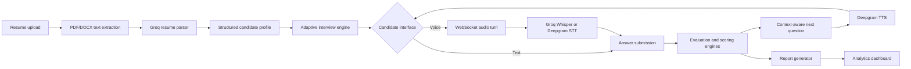

# Verixa

**AI-Powered Interview & Candidate Assessment Platform**

[](https://react.dev/)
[](https://fastapi.tiangolo.com/)
[](https://www.python.org/)
[](https://vite.dev/)
[](backend/LICENSE)

Verixa is an open-source interview practice and candidate assessment application. It turns a candidate's resume into a structured, adaptive technical or HR interview, supports text and voice responses, evaluates each answer, and produces a detailed performance report.

Unlike static question banks, Verixa preserves the full interview conversation and uses the candidate's latest answer to generate contextual follow-up questions. Its time-aware engine adjusts interview depth, stage progression, and difficulty while the session is running.

> **Project status:** Verixa is an actively developed application. Sessions are currently stored in backend memory, while report history and active-session recovery use browser storage. Authentication and persistent server-side storage are not yet implemented.

## Table of contents

- [Overview](#overview)
- [Features](#features)
- [Screenshots](#screenshots)
- [Technology stack](#technology-stack)
- [Architecture](#architecture)
- [Repository structure](#repository-structure)
- [Getting started](#getting-started)
- [Environment variables](#environment-variables)
- [Usage](#usage)
- [API documentation](#api-documentation)
- [Project highlights](#project-highlights)
- [Testing](#testing)
- [Roadmap](#roadmap)
- [Contributing](#contributing)
- [License](#license)
- [Author](#author)

## Overview

Interview preparation tools often ask disconnected questions and return generic feedback. Verixa addresses that problem with a conversation-driven interview engine that:

1. extracts structured candidate information from a PDF or DOCX resume;
2. creates an interview for a selected role and interview type;
3. asks resume-aware questions and drills into topics mentioned by the candidate;
4. adapts its depth and difficulty to performance and remaining time;
5. evaluates communication, technical relevance, confidence, and professionalism; and
6. generates a dashboard-ready assessment report.

Verixa is designed for:

- **Students and job seekers** practicing realistic technical and HR interviews;
- **Recruiters and hiring teams** exploring structured AI-assisted assessment workflows;
- **Educators and placement programs** helping candidates identify focused improvement areas; and
- **Developers and researchers** experimenting with conversational interview orchestration, speech services, and LLM-based evaluation.

## Features

### Resume intelligence

- Upload and parse PDF and DOCX resumes.
- Extract candidate identity, contact details, skills, education, experience, projects, certifications, and languages.
- Use Groq for structured resume extraction.
- Fall back to deterministic parsing when the LLM is unavailable or times out.
- Validate upload type and size before processing.

### Adaptive interview engine

- Technical and HR interview modes with separate personas and stage plans.
- Resume- and role-specific question generation.
- Context-aware acknowledgement and follow-up questions grounded in the candidate's latest answer.
- Full conversation history supplied to the interviewer for continuity.
- Duplicate and near-duplicate question protection.
- Progressive stages covering warm-up, experience, technical or HR depth, behavioral assessment, and closing.
- Dynamic difficulty adjustment based on candidate scores.
- Configurable interview duration and question limits.
- Time modes that move from detailed questioning to concise prompts and wrap-up behavior.

### Voice and text interviews

- Browser-based microphone capture with silence-based end-of-answer detection.
- Turn-based realtime transport over WebSocket.
- Speech-to-text through Groq Whisper by default, with Deepgram STT support and fallback behavior.
- Deepgram text-to-speech for interviewer responses.
- Strict speak-then-listen turn handling to prevent the interviewer audio from being transcribed as the candidate.
- Text-response mode when voice input is unavailable or not preferred.

### Evaluation and reporting

- Per-answer LLM evaluation and detailed scoring.
- Communication, technical relevance, confidence, and professionalism dimensions.
- Weighted overall score and performance classification.
- Strengths, weaknesses, recommendations, and learning resources.
- Question-by-question evaluation details.
- Score progression and competency charts powered by Recharts.
- Candidate tier, weak-area identification, interview timing, and response analytics.
- Local interview history and report reopening in the frontend.

### Product interface

- Responsive dark enterprise interface built with React.
- Overview dashboard with completed interview, average score, latest score, and session-status metrics.
- Structured resume setup, professional interview room, live transcript, timer, candidate details, and meeting controls.
- Accessible focus states, semantic navigation, and responsive desktop/mobile layouts.

## Screenshots

Replace these placeholders with current application captures when publishing a release.

| Dashboard | Resume upload |
| --- | --- |
|  |  |

| Interview room | Interview report |
| --- | --- |
|  |  |

## Technology stack

| Category | Technologies | Purpose |
| --- | --- | --- |
| Frontend | React 18, React Router 7, Vite 6 | Single-page application, routing, and development build tooling |
| UI and visualization | CSS, Lucide React, Recharts | Responsive interface, icons, score trends, and competency charts |
| HTTP client | Axios | Frontend-to-backend API requests |
| Backend | Python, FastAPI, Uvicorn, Pydantic | REST/WebSocket APIs, request validation, and application models |
| AI/LLM | Groq OpenAI-compatible API, configurable Groq model | Resume extraction, adaptive questions, answer evaluation, and feedback |
| Speech | Groq Whisper, Deepgram SDK 7.5 | Speech-to-text and text-to-speech |
| Document processing | pdfplumber, python-docx | PDF and DOCX resume text extraction |
| Networking | HTTPX, FastAPI WebSocket | External AI requests and voice-turn transport |
| State | In-memory backend sessions, browser `localStorage` | Active interview state and local report history |
| Testing | Pytest, FastAPI TestClient | Backend service and API coverage |

Verixa currently has **no database, authentication provider, or deployment framework** configured in the repository.

## Architecture



### Interview turn lifecycle

```text
Interviewer question
        │
        ▼
TTS playback completes
        │
        ▼
Candidate microphone/text input
        │
        ▼
Transcription → evaluation → score update
        │
        ▼
Context-aware follow-up or stage transition
```

The backend is the source of truth for interview timing, evaluation, question history, and session progression. The frontend manages the user experience, audio capture, local timer display, and browser-local report history.

## Repository structure

```text
.
├── backend/
│   ├── app/
│   │   ├── data/                 # Role-specific interview context
│   │   ├── models/               # Pydantic request, session, and report models
│   │   ├── routers/              # Resume, interview, and voice REST endpoints
│   │   ├── services/             # Parsing, AI, speech, scoring, timing, and reports
│   │   ├── utils/                # PDF and DOCX helpers
│   │   ├── websocket/            # Realtime voice interview endpoint
│   │   ├── config.py             # Environment-driven settings
│   │   └── main.py               # FastAPI application entrypoint
│   ├── scripts/                  # Service diagnostic scripts
│   ├── test_audio/               # Local speech test samples
│   ├── tests/                    # Backend automated tests
│   ├── .env.example
│   ├── LICENSE
│   └── requirements.txt
├── frontend/
│   ├── src/
│   │   ├── components/           # Shared UI and voice recorder components
│   │   ├── context/              # Interview state and browser persistence
│   │   ├── pages/                # Overview, setup, interview, report, and history
│   │   ├── services/             # REST and WebSocket clients
│   │   ├── styles/               # Global design system
│   │   ├── App.jsx
│   │   └── routes.jsx
│   ├── .env.example
│   ├── index.html
│   ├── package.json
│   └── vite.config.js
└── README.md
```

## Getting started

### Prerequisites

- Python 3.10 or newer
- Node.js 18 or newer and npm
- A Groq API key
- A Deepgram API key for voice synthesis and Deepgram-backed speech features

### 1. Clone the repository

```bash
git clone https://github.com/springboardmentor441p-coderr/AI-Powered-Mock-Interview-and-Candidate-Assessment-Platform.git
cd AI-Powered-Mock-Interview-and-Candidate-Assessment-Platform
```

### 2. Configure and run the backend

#### macOS or Linux

```bash
cd backend
python3 -m venv venv
source venv/bin/activate
pip install -r requirements.txt
cp .env.example .env
uvicorn app.main:app --reload --host 127.0.0.1 --port 8000
```

#### Windows PowerShell

```powershell
cd backend
py -m venv venv
.\venv\Scripts\Activate.ps1
pip install -r requirements.txt
Copy-Item .env.example .env
uvicorn app.main:app --reload --host 127.0.0.1 --port 8000
```

Edit `backend/.env` and replace the example API keys before starting an AI or voice interview.

### 3. Configure and run the frontend

Open a second terminal from the repository root:

```bash
cd frontend
npm install
```

Create the local environment file:

```bash
# macOS or Linux
cp .env.example .env
```

```powershell
# Windows PowerShell
Copy-Item .env.example .env
```

Then start Vite:

```bash
npm run dev
```

Open the local URL printed by Vite. The default backend URL in the example configuration is `http://127.0.0.1:8000`.

## Environment variables

### Backend

| Variable | Required | Default | Description |
| --- | --- | --- | --- |
| `GROQ_API_KEY` | Yes | — | Groq credential used for resume parsing, interviewer generation, batch evaluation, feedback, and optional Whisper fallback transcription |
| `GROQ_BASE_URL` | No | `https://api.groq.com/openai/v1` | Base URL for the Groq OpenAI-compatible API |
| `GROQ_MODEL` | No | `llama-3.1-8b-instant` | Chat model used by Groq-backed interview services |
| `GROQ_TIMEOUT_SECONDS` | No | `60` | Overall Groq request timeout in seconds |
| `GROQ_CONNECT_TIMEOUT_SECONDS` | No | `10` | Groq connection timeout in seconds |
| `GROQ_MAX_TOKENS` | No | `2048` | Maximum generated tokens for Groq chat requests |
| `DEEPGRAM_API_KEY` | Required for voice | — | Deepgram credential used for TTS and Deepgram speech recognition |
| `VOICE_STT_PROVIDER` | No | `deepgram` | Speech-to-text provider; `deepgram` enables live streaming and `groq` uses buffered Whisper transcription |
| `DEEPGRAM_STT_MODEL` | No | `nova-3` | Deepgram prerecorded speech-to-text model |
| `DEEPGRAM_LIVE_MODEL` | No | `nova-3` | Model used when creating a Deepgram live connection |
| `DEEPGRAM_TTS_MODEL` | No | `aura-2-thalia-en` | Deepgram voice model used for interviewer speech |
| `DEEPGRAM_LANGUAGE` | No | `en` | Speech-recognition language code |
| `DEEPGRAM_MAX_AUDIO_MB` | No | `25` | Maximum accepted candidate audio size in megabytes |
| `GENERATED_AUDIO_DIR` | No | `generated_audio` | Directory used for synthesized interviewer audio |
| `MAX_FILE_SIZE_MB` | No | `10` | Maximum resume upload size in megabytes |

### Frontend

| Variable | Required | Default/example | Description |
| --- | --- | --- | --- |
| `VITE_API_BASE_URL` | Yes | `http://127.0.0.1:8000` | FastAPI base URL used by REST and WebSocket clients |

Never commit real API keys. Keep secrets in `backend/.env` or your deployment platform's secret manager.

## Usage

1. Open **New interview** from the Verixa sidebar.
2. Upload a PDF or DOCX resume and wait for the candidate profile preview.
3. Choose a technical or HR interview, enter the target role, and select a duration.
4. Start the interview and join the voice session, or switch to text responses.
5. Answer one question at a time. Verixa stores the transcript and asks a contextual next question without blocking on evaluation.
6. Continue until the configured limit or timer completes, or end the interview manually.
7. Review the generated report, competency scores, question-level feedback, strengths, weaknesses, and recommendations.
8. Reopen locally saved reports from **History**.

## API documentation

With the backend running at `http://127.0.0.1:8000`, FastAPI provides:

- Swagger UI: [`http://127.0.0.1:8000/docs`](http://127.0.0.1:8000/docs)
- ReDoc: [`http://127.0.0.1:8000/redoc`](http://127.0.0.1:8000/redoc)
- OpenAPI schema: [`http://127.0.0.1:8000/openapi.json`](http://127.0.0.1:8000/openapi.json)

### Main endpoints

| Method | Endpoint | Purpose |
| --- | --- | --- |
| `GET` | `/health` | Service liveness check |
| `POST` | `/resume/parse` | Parse a PDF or DOCX resume into structured candidate data |
| `POST` | `/parse-resume` | Legacy resume-parser endpoint |
| `POST` | `/interview/start` | Create an interview session and return the opening question |
| `POST` | `/interview/answer` | Submit a text answer and advance the interview |
| `POST` | `/interview/end` | Complete a session and generate its report |
| `POST` | `/voice/interview` | Submit a recorded voice answer over HTTP |
| `WS` | `/voice/stream/{session_id}` | Run turn-based realtime voice interview messaging |
| `GET` | `/voice/audio/{filename}` | Retrieve generated interviewer audio |
| `POST` | `/voice/test-stt` | Validate speech-to-text configuration |
| `POST` | `/voice/test-tts` | Validate text-to-speech configuration |

## Project highlights

- **Conversation-first interviewing:** questions acknowledge and build upon the candidate's latest response instead of behaving like an unrelated question bank.
- **Resume-grounded personalization:** projects, skills, experience, and target-role context guide the interview without inventing candidate details.
- **Time-aware control:** interview stages and wrap-up behavior respond to interview progress and remaining time.
- **Safe voice turn-taking:** interviewer playback completes before candidate listening begins, reducing self-transcription and race conditions.
- **Deferred multidimensional evaluation:** answers are batch-scored for communication, technical relevance, confidence, and professionalism when the report is generated.
- **Live incremental transcription:** browser audio is forwarded to Deepgram throughout the candidate's answer instead of uploaded only after it ends.
- **Graceful degradation:** deterministic resume parsing, evaluation fallbacks, and browser speech synthesis keep core flows usable when an external AI service fails.

## Testing

Run the backend test suite from `backend/` with the virtual environment active:

```bash
pip install pytest
python -m pytest -q tests
```

Build the frontend from `frontend/`:

```bash
npm run build
```

The backend tests mock external LLM requests, so they do not consume Groq or Deepgram credits.

## Roadmap

The following items are planned directions and are **not implemented yet**:

- Persistent PostgreSQL or managed database storage
- User authentication and role-based access control
- Recruiter and organization workspaces
- Candidate invitations and shareable assessment links
- Coding exercises with sandboxed execution
- Incremental interviewer text and audio streaming
- AI interviewer avatars and richer meeting experiences
- Applicant tracking system integrations
- Company-specific question libraries and competency frameworks
- Multi-agent panel interviews
- Production deployment, observability, rate limiting, and background jobs

## Contributing

Contributions are welcome.

1. Fork the repository.
2. Create a focused branch:

   ```bash
   git checkout -b feature/short-description
   ```

3. Make your changes and add or update tests.
4. Run the backend tests and frontend production build.
5. Commit with a clear message.
6. Push your branch and open a pull request describing the problem, solution, and verification performed.

Keep pull requests focused, avoid committing credentials or generated audio, and preserve existing API behavior unless the change is explicitly documented.

## License

Verixa is available under the [MIT License](backend/LICENSE).

## Author

Maintainer information can be updated before publication:

- **Name:** Mahir Thakur
- **GitHub:** [@Mathir1057](https://github.com/Mahir1057)
- **Email:** `thakurmahir870@gmail.com`

---

If Verixa supports your interview preparation or assessment workflow, consider starring the repository and contributing improvements.
