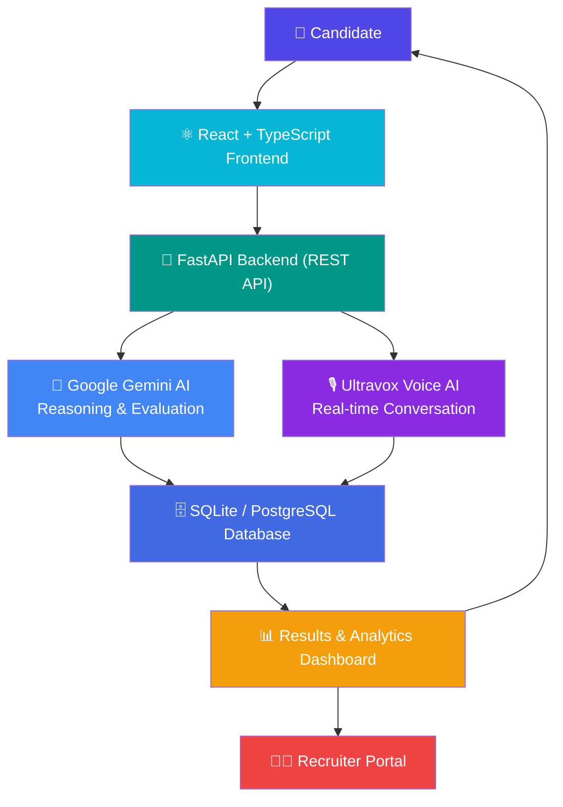

<div align="center">

# 🚀 SmartHire AI

### Intelligent AI-Powered Recruitment, Mock Interview & Candidate Assessment Platform

**Practice. Perform. Get Hired — with AI.**

[](https://react.dev/)
[](https://www.typescriptlang.org/)
[](https://fastapi.tiangolo.com/)
[](https://www.python.org/)
[](https://ai.google.dev/)
[](https://ultravox.ai/)
[](https://tailwindcss.com/)
[](https://www.postgresql.org/)
[](https://jwt.io/)
[](#-license)

[](https://github.com/jaswanthpatibandla-35/SmartHire-AI/stargazers)
[](https://github.com/jaswanthpatibandla-35/SmartHire-AI/network/members)
[](https://github.com/jaswanthpatibandla-35/SmartHire-AI/commits/main)

<br/>

<p align="center">
  
</p>

<p align="center">
  <a href="#-features"><b>Features</b></a> •
  <a href="#-artificial-intelligence-engine">AI Engine</a> •
  <a href="#-screenshots">Screenshots</a> •
  <a href="#-installation">Installation</a> •
  <a href="#-api-endpoints">API</a> •
  <a href="#-contributing">Contributing</a>
</p>

</div>

---

## 📖 Table of Contents

- [Why SmartHire AI?](#-why-smarthire-ai)
- [Features](#-features)
- [Artificial Intelligence Engine](#-artificial-intelligence-engine)
- [ATS Resume Checker](#-ats-resume-checker)
- [AI Voice Interview](#-ai-voice-interview)
- [Live Coding Assessment](#-live-coding-assessment)
- [Analytics Dashboard](#-analytics-dashboard)
- [Security](#-security)
- [Technology Stack](#-technology-stack)
- [System Architecture](#-system-architecture)
- [Folder Structure](#-folder-structure)
- [Installation](#-installation)
- [Environment Variables](#-environment-variables)
- [API Endpoints](#-api-endpoints)
- [Screenshots](#-screenshots)
- [Testing](#-testing)
- [Future Enhancements](#-future-enhancements)
- [Contributing](#-contributing)
- [License](#-license)
- [Developed By](#-developed-by)

---

## 💡 Why SmartHire AI?

> Traditional hiring is slow, inconsistent, and often unfair to candidates.

| ❌ The Problem | ✅ How SmartHire AI Solves It |
|---|---|
| Recruiters manually skim hundreds of resumes | AI-powered ATS parsing extracts skills, experience & education in seconds |
| Resume screening is inconsistent and keyword-blind | Objective ATS compatibility scoring with keyword & skill-gap analysis |
| Interview quality depends on the interviewer's mood/bias | Adaptive AI interviewer asks consistent, context-aware questions every time |
| Candidates get little to no interview feedback | Detailed multi-dimensional performance reports generated after every session |
| Scheduling & coordinating interviews is a logistical burden | Built-in scheduling, live rooms, and a unified recruiter workspace |
| Text-only interviews feel robotic | Natural, real-time **voice conversations** powered by Ultravox + LLM reasoning |

**SmartHire AI** closes this gap by combining resume intelligence, conversational AI, and structured analytics into a single, end-to-end hiring pipeline — giving candidates a realistic practice ground and recruiters a data-driven decision engine.

---

## ✨ Features

### 👨‍💻 Candidate Portal

| Feature | Description |
|---|---|
| 🔐 Secure Registration & Login | Email/password auth with role selection (Candidate / Recruiter) |
| 🪪 Unique SmartHire ID | Auto-generated candidate ID (e.g. `SH-CAN-2026-000005`) with QR sharing |
| 📄 ATS Resume Upload & Analysis | Drag-and-drop PDF parsing with instant skill extraction |
| 📊 ATS Resume Score Checker | Compatibility, interview-readiness & skill-match scoring |
| 💡 Resume Improvement Suggestions | Missing keywords, weak bullet points, missing action verbs |
| 🎯 AI Career Recommendations | Suggested job profiles ranked by match percentage |
| 🤖 AI Mock Interviews | Fully adaptive technical / HR / behavioral interviews |
| 🎙️ Voice-Based Interviews (Ultravox) | Real-time, human-like spoken conversation |
| 💬 Live Conversation Transcript | Synced speech-to-text chat log |
| 📅 Interview History | Track every session, score, and status |
| 📥 Downloadable Reports | PDF / DOCX / TXT / JSON export |
| 📈 Performance Dashboard | Score trend, best score, average score, skills detected |

### 👨‍💼 Recruiter Portal

| Feature | Description |
|---|---|
| 🧭 Recruiter Dashboard | Centralized hiring workspace |
| 🔍 Candidate Search by SmartHire ID | Instant lookup across the candidate pool |
| 🗓️ Interview Scheduling | Create and manage upcoming interview slots |
| 🚪 Live Interview Rooms | Secure, real-time recruiter ↔ candidate sessions |
| 💬 Candidate Chat | Direct in-platform communication |
| 📤 Interview Invitations | Automated invite delivery |
| 📋 Candidate Report Review | Full transcript + AI evaluation per candidate |
| ⚖️ Shortlist / Reject Workflow | One-click hiring decisions |
| 📊 Recruiter Analytics Dashboard | Aggregate pipeline insights |

---

## 🧠 Artificial Intelligence Engine

SmartHire AI's intelligence layer is built around **LLM reasoning + real-time voice synthesis**:

| Capability | Description |
|---|---|
| 🌐 **Google Gemini Integration** | Core reasoning engine for adaptive question generation & evaluation |
| 🗣️ **Ultravox Voice AI** | Low-latency, natural voice conversation engine |
| ✍️ **Speech-to-Text** | Converts candidate responses into an evaluable transcript in real time |
| 🧩 **Prompt Engineering** | Role-, difficulty-, and domain-aware prompt templates |
| 🔄 **Context Awareness** | Interviewer "remembers" prior answers to ask relevant follow-ups |
| 🎯 **Adaptive Questioning** | Difficulty and topic shift dynamically based on candidate responses |
| 🧮 **Multi-Dimensional Evaluation** | Technical, Communication, Confidence, Problem-Solving, Grammar, Behavioral |
| 📝 **Automated Feedback Generation** | Strengths, areas for improvement, and an actionable learning roadmap |
| 🏆 **Candidate Ranking** | Score-based ranking to support recruiter shortlisting |

---

## 📄 ATS Resume Checker

<p align="center">
  
</p>

- 🔍 **Resume Parsing** — extracts name, contact info, links, skills & experience from PDF
- 🧬 **Skill Extraction** — auto-detects technical skills with proficiency levels
- 🔑 **Keyword Matching** — compares resume content against target-role keywords
- 📊 **ATS Compatibility Score** — confidence-scored breakdown (compatibility, readiness, skill match)
- ⚠️ **Missing Skill Detection** — flags high-value skills absent from the resume
- 🧭 **Critical ATS Weaknesses** — missing keywords, weak bullet points, missing action verbs
- 📈 **Suggested Job Profiles** — ranked role matches with core parameter gaps
- 🎓 **Certifications & Badges Extraction** — auto-detects verified credentials

> 💬 **Tip:** Run your resume through the analyzer *before* your interview — the extracted skill profile is used to generate personalized interview questions.

---

## 🎙️ AI Voice Interview

<p align="center">
  
</p>

| Capability | Details |
|---|---|
| 🔊 Ultravox Integration | Real-time, low-latency voice pipeline |
| 🗨️ Natural Language Understanding | Understands free-form spoken answers |
| 🎧 Speech Recognition + Text-to-Speech | Bidirectional voice conversation |
| 🧠 Context Memory | Maintains conversation state across the full session |
| ➕ Dynamic Follow-Up Questions | Interviewer probes deeper based on prior answers |
| 🧑‍🤝‍🧑 Human-Like Conversation | Named AI interviewer persona (e.g. "Aman — Senior Technical Interviewer") |
| ⏱️ Interview Timer | Configurable duration (15–120 minutes) |
| ✅ Interview Completion Detection | Auto-closes and routes to evaluation |
| 📊 Automatic Evaluation | Instant multi-dimensional scoring after submission |

**Interview setup flow:** Configure Role & Difficulty → Hardware Diagnostics (mic/cam/network) → Secure Lobby → Live Interview Chamber → AI-Generated Report.

---

## 💻 Live Coding Assessment

> 🚧 **Roadmap feature** — architecture designed, integration in progress.

| Planned Capability | Description |
|---|---|
| 🖥️ Multi-Language Editor | Support for Python, Java, JavaScript, C++ |
| ⚙️ Compilation & Execution | Sandbox-based real-time code execution |
| 🧪 Hidden Test Cases | Automated correctness verification |
| ⏱️ Time Complexity Analysis | Big-O estimation of submitted solutions |
| 📦 Space Complexity Analysis | Memory-efficiency scoring |
| 🤖 AI Code Review | LLM-based code quality & best-practice feedback |
| 🏅 Performance Score | Combined correctness + efficiency + style score |

---

## 📊 Analytics Dashboard

<p align="center">
  
</p>

| Metric | Visualized As |
|---|---|
| Overall Score | Circular progress ring + grade badge |
| Technical / Communication / Confidence / Problem-Solving / Grammar / Behavioral | Radar chart + horizontal bar chart |
| Voice & Speech Telemetry | Speaking pace (WPM), filler words, eye-contact ratio, response clarity |
| Historical Score Improvement | Line chart across sessions |
| Full Transcript | Searchable, timestamped conversation log |
| Report Export | PDF, DOCX, TXT transcript, raw JSON |

---

## 🔐 Security

- 🔑 **JWT Authentication** — stateless, signed session tokens
- 🧑‍💻 **Role-Based Access Control** — separate Candidate / Recruiter permissions
- 🔒 **Secure Password Encryption** — hashed credential storage
- 🛡️ **Protected REST APIs** — auth-guarded endpoints across the platform
- 🖥️ **Hardware Diagnostics Lock** — verifies mic/camera/network before granting chamber access
- 🕵️ **Proctoring Signals** — session trust score & activity monitoring during interviews

---

## 🛠 Technology Stack

<table>
<tr>
<td valign="top" width="50%">

**Frontend**

| Tech | Purpose |
|---|---|
| React 19 | UI framework |
| TypeScript | Type safety |
| Vite | Build tooling |
| Tailwind CSS | Styling |
| React Router | Client-side routing |
| Framer Motion | Animation |

**Artificial Intelligence**

| Tech | Purpose |
|---|---|
| Google Gemini API | Reasoning & evaluation |
| Ultravox Voice AI | Real-time voice conversation |
| Speech-to-Text | Transcript generation |
| LLMs | Adaptive Q&A + scoring |

</td>
<td valign="top" width="50%">

**Backend**

| Tech | Purpose |
|---|---|
| FastAPI | REST API framework |
| Python | Core backend language |
| SQLAlchemy | ORM |
| SQLite / PostgreSQL | Data persistence |

**Authentication & Deployment**

| Tech | Purpose |
|---|---|
| JWT | Session authentication |
| Vercel / Netlify | Frontend hosting |
| Render | Backend hosting |
| PostgreSQL | Production database |

</td>
</tr>
</table>

---

## 🏗 System Architecture



---

## 📂 Folder Structure

```
SmartHire-AI
│
├── frontend
│   ├── src
│   ├── components
│   ├── pages
│   ├── services
│   ├── assets
│   └── public
│
├── backend
│   ├── app
│   ├── api
│   ├── models
│   ├── database
│   ├── services
│   └── utils
│
├── screenshots
├── docs
└── README.md
```

---

## 🚀 Installation

### Clone the Repository

```bash
git clone https://github.com/jaswanthpatibandla-35/SmartHire-AI.git
cd SmartHire-AI
```

### Frontend Setup

```bash
cd frontend
npm install
npm run dev
```

### Backend Setup

```bash
cd backend
pip install -r requirements.txt
python -m uvicorn app.main:app --reload
```

> 📝 **Note:** Ensure Node.js ≥ 18 and Python ≥ 3.11 are installed before running the above commands.

---

## 🔑 Environment Variables

Create a `.env` file in the `backend/` directory:

```env
GEMINI_API_KEY=your_gemini_api_key
ULTRAVOX_API_KEY=your_ultravox_api_key
JWT_SECRET_KEY=your_secret_key
DATABASE_URL=your_database_url
```

---

## 🔌 API Endpoints

<details>
<summary><b>🔐 Authentication</b></summary>

| Method | Endpoint | Description |
|---|---|---|
| POST | `/api/auth/register` | Register a new candidate/recruiter |
| POST | `/api/auth/login` | Authenticate and receive a JWT |
| GET | `/api/auth/me` | Get current authenticated user |

</details>

<details>
<summary><b>📄 Resume</b></summary>

| Method | Endpoint | Description |
|---|---|---|
| POST | `/api/resume/upload` | Upload and parse a resume PDF |
| GET | `/api/resume/{id}/score` | Retrieve ATS compatibility score |
| GET | `/api/resume/{id}/suggestions` | Get improvement suggestions |

</details>

<details>
<summary><b>🎙️ Interview</b></summary>

| Method | Endpoint | Description |
|---|---|---|
| POST | `/api/interview/create` | Configure and start a new interview session |
| POST | `/api/interview/{id}/message` | Submit a candidate response |
| POST | `/api/interview/{id}/end` | End the session and trigger evaluation |
| GET | `/api/interview/{id}/report` | Fetch the AI-generated report |

</details>

<details>
<summary><b>💻 Coding</b></summary>

| Method | Endpoint | Description |
|---|---|---|
| POST | `/api/code/execute` | Execute submitted code against test cases |
| GET | `/api/code/{id}/result` | Retrieve execution & evaluation result |

</details>

<details>
<summary><b>👨‍💼 Recruiter</b></summary>

| Method | Endpoint | Description |
|---|---|---|
| GET | `/api/recruiter/candidates` | List/search candidates |
| POST | `/api/recruiter/schedule` | Schedule an interview |
| POST | `/api/recruiter/decision` | Shortlist or reject a candidate |

</details>

<details>
<summary><b>📊 Analytics</b></summary>

| Method | Endpoint | Description |
|---|---|---|
| GET | `/api/analytics/dashboard` | Candidate performance summary |
| GET | `/api/analytics/history` | Historical score trend |

</details>

---

## 📸 Screenshots

<div align="center">

### 1️⃣ Landing Page
Modern, conversion-focused landing page showcasing SmartHire AI's core value proposition.


---

### 2️⃣ Login Page
Secure sign-in with password, Face ID, and device-lock options.


---

### 3️⃣ Registration Page
Candidate/Recruiter account creation with role selection.


---

### 4️⃣ Account Created
Instant confirmation with an auto-generated SmartHire ID — zero email verification friction.


---

### 5️⃣ Candidate Dashboard
Centralized workspace with interview stats, score trend, and recent sessions.


---

### 6️⃣ Resume Analyzer
Upload interface for AI-driven resume parsing and scoring.


---

### 7️⃣ Platform Features Console
Interactive overview of AI-powered interviews, ATS analysis, coding assessments, and recruiter tools.


---

### 8️⃣ ATS Resume Upload
Drag-and-drop resume submission that kicks off AI skill extraction.


---

### 9️⃣ Resume Analysis Results
Extracted candidate credentials, technical skills, and ATS scorecard.


---

### 🔟 Experience & Certifications
Auto-detected work experience, AI-graded projects, and verified certifications.


---

### 1️⃣1️⃣ Critical ATS Weaknesses
Actionable breakdown of missing keywords, weak bullet points, and missing skills.


---

### 1️⃣2️⃣ AI Interview Generator
Configure interview type, difficulty, and domain to generate a tailored assessment.


---

### 1️⃣3️⃣ Interview Room Setup
Select target role, interview mode, difficulty grade, and time limit.


---

### 1️⃣4️⃣ Hardware Diagnostics
Pre-interview microphone, webcam, and network verification.


---

### 1️⃣5️⃣ Hardware Check — Passed
All system checks confirmed before entering the secure chamber.


---

### 1️⃣6️⃣ Interview Lobby
Final session summary before entering the live assessment chamber.


---

### 1️⃣7️⃣ Live AI Voice Interview
Real-time conversation with the AI interviewer, powered by Ultravox.


---

### 1️⃣8️⃣ Interview Results Report
Multi-dimensional performance matrix with overall grade and hiring readiness.


---

### 1️⃣9️⃣ Full Transcript & Telemetry
Searchable interview transcript with speech pace, filler words, and score history.


---

### 2️⃣0️⃣ Recruiter Decision Panel
Voice telemetry, eye-contact ratio, and export options for recruiter review.


---

### 2️⃣1️⃣ Live Interview Rooms
Join scheduled, real-time recruiter-led interview sessions.


---

### 2️⃣2️⃣ Interview History
Complete session log with status, score, and transcript access.


</div>

---

## 🧪 Testing

### Functional Testing

- ✅ User Registration & Login
- ✅ Resume Upload & ATS Parsing
- ✅ ATS Score Generation
- ✅ AI Interview Initiation
- ✅ Voice Conversation & Speech-to-Text
- ✅ AI Evaluation & Report Generation
- ✅ Interview History & Transcript Retrieval
- ✅ Recruiter Dashboard & Scheduling
- ✅ PDF/DOCX/JSON Report Download

### API Testing

Tested using:

- Postman
- FastAPI Swagger UI
- Browser Developer Tools

**Verified scenarios:** successful requests · authentication · invalid requests · missing parameters · database validation · error handling · response schema validation

### Additional Testing Layers

| Type | Coverage |
|---|---|
| 🔗 Integration Testing | Frontend ↔ Backend ↔ AI service handshakes |
| 🎨 UI Testing | Cross-browser, responsive layout checks |
| 🔒 Security Testing | JWT expiry, role-guard bypass attempts |
| ⚡ Performance Testing | API latency & concurrent session load |

---

## 🚀 Future Enhancements

- 🎭 AI Interview Avatar
- 🎥 AI Video Interview Analysis
- 😊 Emotion Detection
- 👁️ Eye Contact / Gaze Analysis
- 🌍 Multi-Language Interviews
- 🏢 Enterprise Recruiter Dashboard
- 📧 Email Notifications
- 📱 Mobile Application
- ☁️ Cloud Storage Integration
- 🎬 Interview Recording
- 🤝 AI Hiring Assistant

---

## 🤝 Contributing

Contributions are what make the open-source community amazing! Any contributions are **greatly appreciated**.

1. 🍴 Fork the repository
2. 🌿 Create your feature branch (`git checkout -b feature/AmazingFeature`)
3. 💾 Commit your changes (`git commit -m 'Add some AmazingFeature'`)
4. 📤 Push to the branch (`git push origin feature/AmazingFeature`)
5. 🔁 Open a Pull Request

> 💬 **Note:** Please open an issue first to discuss major changes before submitting a PR.

---

## 📜 License

This project is developed for **educational, research, and learning purposes** under the MIT License. See [`LICENSE`](LICENSE) for details.

---

## 👨‍💻 Developed By

<div align="center">

**Patibandla Jaswanth**

B.Tech — Information Technology
GMR Institute of Technology

[](https://github.com/jaswanthpatibandla-35)

<br/>

⭐ **If SmartHire AI helped you, consider giving it a star!** ⭐

</div>
