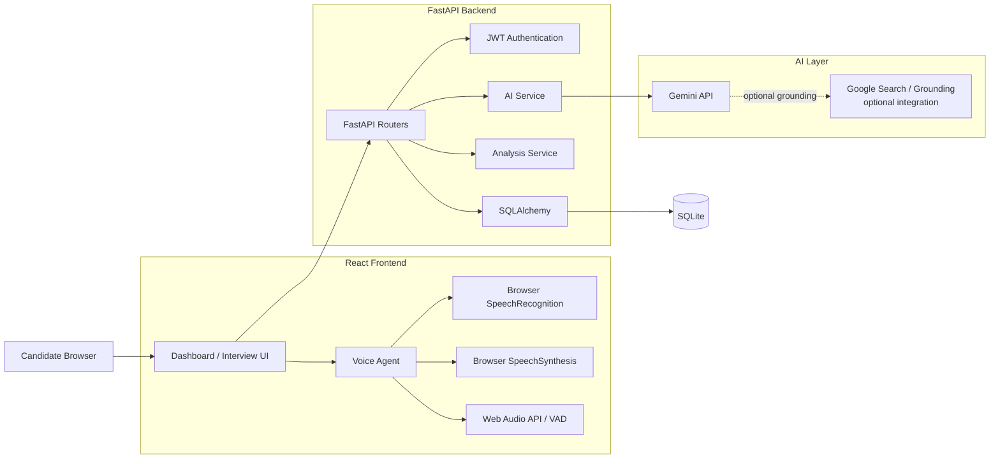
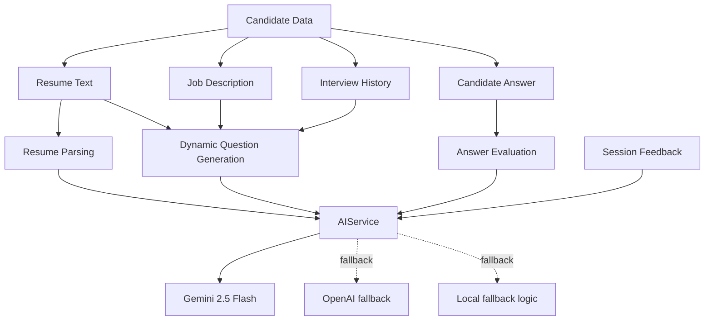
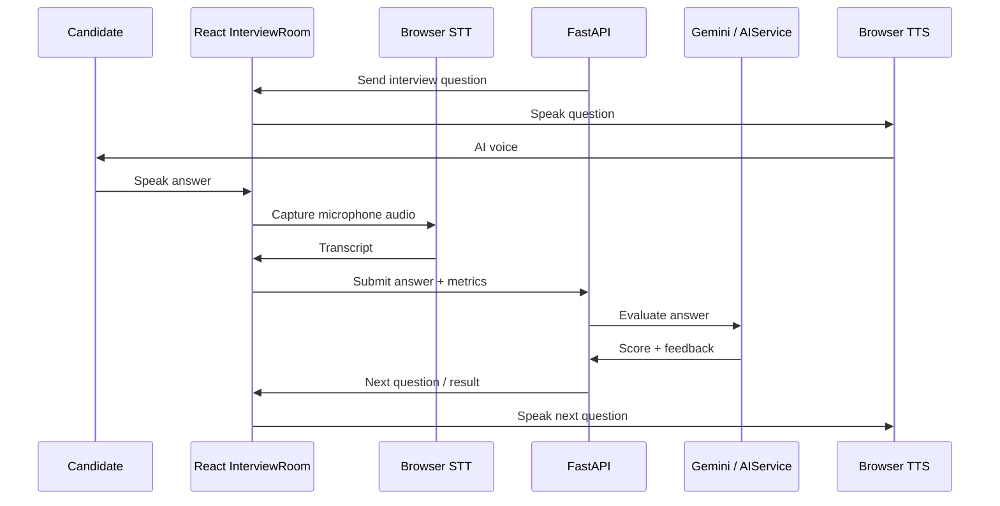
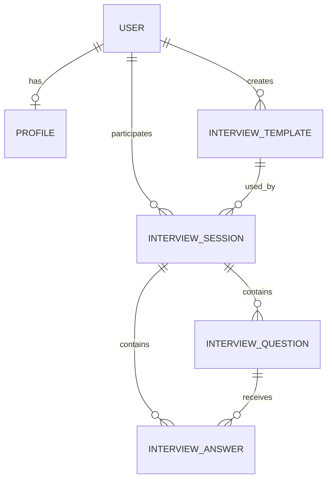
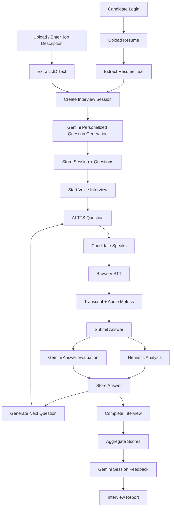

# Intervique — AI-Powered Mock Interview & Assessment Platform

> An AI-powered mock interview platform that creates personalized interviews from a candidate's resume and job description, conducts a browser-based voice interview, evaluates responses, and produces a structured performance report.

## Overview

**Intervique** is a full-stack AI mock-interview platform designed to simulate a realistic technical, behavioral, HR, and aptitude interview.

The application combines:

- Resume parsing and candidate profiling
- Job-description-aware interview generation
- Gemini-powered question generation and answer evaluation
- Browser-based Speech-to-Text (STT)
- Browser-based Text-to-Speech (TTS)
- Voice activity detection and silence handling
- AI interruption / barge-in handling
- Real-time interview state management
- Heuristic speech analytics such as WPM and filler-word detection
- Technical, communication, confidence, and professionalism scoring
- Persistent interview sessions and answer history
- AI-generated strengths, weaknesses, recommendations, and learning resources
- React dashboard and interview-report visualizations

The supplied implementation uses **FastAPI + SQLAlchemy + SQLite** on the backend and **React + Vite + Axios** on the frontend.

---

## High-Level Architecture



### Important implementation note

The supplied source code directly confirms **Gemini API integration** and browser-native **SpeechRecognition / SpeechSynthesis**. It does **not** contain a concrete Google Search API / Search Grounding implementation. Therefore, the Google Search component shown above should be treated as an **optional/extension layer** unless it is added separately.

---

# 1. Repository Structure

```text
intervique/
│
├── backend/
│   ├── requirements.txt
│   │
│   └── app/
│       ├── __init__.py
│       ├── main.py
│       ├── config.py
│       ├── database.py
│       ├── models.py
│       ├── schemas.py
│       ├── auth.py
│       ├── seed.py
│       │
│       ├── routers/
│       │   ├── __init__.py
│       │   ├── users.py
│       │   ├── resumes.py
│       │   └── interviews.py
│       │
│       └── services/
│           ├── __init__.py
│           ├── ai_service.py
│           └── analysis_service.py
│
├── frontend/
│   ├── package.json
│   ├── package-lock.json
│   ├── index.html
│   ├── vite.config.js
│   ├── postcss.config.js
│   ├── tailwind.config.js
│   │
│   ├── public/
│   │   ├── favicon.svg
│   │   └── icons.svg
│   │
│   └── src/
│       ├── main.jsx
│       ├── App.jsx
│       ├── App.css
│       ├── index.css
│       │
│       ├── services/
│       │   └── api.js
│       │
│       ├── assets/
│       │   ├── react.svg
│       │   └── vite.svg
│       │
│       └── views/
│           ├── Login.jsx
│           ├── Dashboard.jsx
│           ├── ResumeUpload.jsx
│           ├── InterviewSetup.jsx
│           ├── InterviewRoom.jsx
│           ├── InterviewReport.jsx
│           └── Settings.jsx
│
├── consolidate.py
├── sample prompt.txt
└── README.md
```

---

# 2. Backend Architecture

The backend is implemented as a modular **FastAPI application**.

```text
Client
  │
  ▼
FastAPI Router
  │
  ├── Authentication / Authorization
  │
  ├── Request Validation
  │
  ▼
Application Service
  │
  ├── AIService
  │     ├── Resume Parsing
  │     ├── Question Generation
  │     ├── Answer Evaluation
  │     └── Session Feedback
  │
  ├── AnalysisService
  │     ├── WPM
  │     ├── Filler Words
  │     ├── Communication
  │     ├── Confidence
  │     ├── Technical Relevance
  │     └── Professionalism
  │
  ▼
SQLAlchemy ORM
  │
  ▼
SQLite Database
```

## Backend files

### `backend/app/main.py`

Application entry point.

Responsibilities:

- Creates database tables
- Performs lightweight SQLite column migration checks
- Creates the FastAPI application
- Configures CORS
- Registers routers
- Mounts the uploads directory
- Exposes the root health/status endpoint

### `backend/app/config.py`

Central application configuration.

Important settings include:

```text
PROJECT_NAME
SECRET_KEY
ALGORITHM
ACCESS_TOKEN_EXPIRE_MINUTES
DATABASE_URL
UPLOAD_DIR
```

Default database:

```text
sqlite:///./instance/smarthire.db
```

### `backend/app/database.py`

SQLAlchemy database infrastructure.

Responsibilities:

- Creates SQLAlchemy engine
- Creates `SessionLocal`
- Creates declarative `Base`
- Provides the `get_db()` dependency
- Creates the SQLite directory when required

### `backend/app/models.py`

Contains the SQLAlchemy ORM models:

- `User`
- `Profile`
- `InterviewTemplate`
- `InterviewSession`
- `InterviewQuestion`
- `InterviewAnswer`

### `backend/app/schemas.py`

Contains Pydantic request/response schemas used by FastAPI.

Examples:

- `UserCreate`
- `UserLogin`
- `Token`
- `ProfileResponse`
- `InterviewSessionCreate`
- `InterviewSessionResponse`
- `InterviewQuestionResponse`
- `InterviewAnswerCreate`
- `InterviewAnswerResponse`

### `backend/app/auth.py`

Authentication and authorization layer.

It implements:

- Password hashing
- Password verification
- JWT access-token creation
- JWT validation
- Current-user dependency
- Role-based authorization

Supported application roles:

```text
candidate
recruiter
admin
```

### `backend/app/seed.py`

Creates demo data for development/testing.

It can populate:

- Demo users
- Candidate profile
- Interview templates
- Completed sample interview
- Questions
- Answers
- Example scores and feedback

---

# 3. Backend Router Structure

```text
backend/app/routers/
│
├── users.py
├── resumes.py
└── interviews.py
```

## `users.py`

Base route:

```text
/api/users
```

Main responsibilities:

- Candidate/recruiter/admin signup
- Login
- JWT authentication
- Current-user profile
- Candidate profile management
- Recruiter candidate listing
- Recruiter candidate-profile access

Important endpoints:

```text
POST /api/users/signup
POST /api/users/login
GET  /api/users/me
GET  /api/users/profile
PUT  /api/users/profile
GET  /api/users/candidates
GET  /api/users/candidate/{candidate_id}/profile
```

## `resumes.py`

Base route:

```text
/api/resumes
```

Main workflow:

```text
PDF Upload
    ↓
PDF Text Extraction
    ↓
AIService.parse_resume()
    ↓
Structured Candidate Profile
    ↓
Database
```

Endpoint:

```text
POST /api/resumes/upload
```

The implementation uses `pypdf` to extract text from PDF files and sends the extracted text to the AI service for structured parsing.

---

# 4. Interview Router

File:

```text
backend/app/routers/interviews.py
```

Base route:

```text
/api/interviews
```

The interview router manages the complete interview lifecycle.

### Session creation

```text
Candidate
   │
   ├── Resume PDF
   ├── Job Description PDF/Text
   ├── Domain
   └── Difficulty
          │
          ▼
    Resume extraction
          │
          ▼
      JD extraction
          │
          ▼
    AI Question Generator
          │
          ▼
    InterviewSession
          │
          ▼
    InterviewQuestion
```

The implementation requires a resume and job description for dynamic interview creation.

The generated interview is personalized using:

- Candidate name
- Resume
- Resume skills
- Job description
- Domain
- Difficulty
- Previous conversation history

---

# 5. AI Service Architecture

File:

```text
backend/app/services/ai_service.py
```

The AI service is the main intelligence layer of the application.



## Gemini integration

The supplied implementation uses:

```text
gemini-2.5-flash
```

through the Google Generative AI Python SDK.

Gemini is used for:

### 1. Resume parsing

Converts raw resume text into structured JSON containing:

```json
{
  "parsed_skills": [],
  "parsed_experience": [],
  "education": [],
  "summary": ""
}
```

### 2. Question generation

Questions are generated from the combination of:

```text
Resume
+
Job Description
+
Domain
+
Difficulty
+
Candidate name
+
Interview history
```

This makes the interview substantially more personalized than a static question bank.

### 3. Answer evaluation

The AI evaluator assesses:

- Technical accuracy
- Completeness
- Depth
- Clarity

and returns:

```json
{
  "score": 0,
  "is_satisfactory": true,
  "feedback_text": "..."
}
```

### 4. Overall session feedback

Gemini generates:

- Strengths
- Weaknesses
- Recommendations
- Learning resources

---

# 6. Google Search / Grounding Layer

For a production version, current external information can be supplied to the LLM through a Google Search / grounding layer.

Recommended architecture:

```text
Candidate Resume
       │
       ├──────────────┐
       │              │
       ▼              ▼
Job Description   Google Search
       │              │
       └──────┬───────┘
              ▼
       Context Builder
              │
              ▼
          Gemini API
              │
              ▼
      Personalized Question
```

Potential use cases:

- Current company information
- Current technology versions
- Recent role requirements
- Industry-specific interview context
- Current technical trends
- Company-specific interview preparation

**Important:** the supplied code confirms Gemini API usage but does not contain an implemented Google Search API/grounding call. If Google Search is part of the deployed version, add its exact API/client configuration and environment variable to this section.

---

# 7. Voice Agent Architecture

The voice agent runs primarily in the browser.

It uses:

- Web Speech API `SpeechRecognition`
- Web Speech API `SpeechSynthesis`
- Web Audio API
- `MediaRecorder`
- Browser microphone permissions
- Browser webcam access



---

# 8. STT — Speech-to-Text

The implementation uses the browser's:

```javascript
window.SpeechRecognition ||
window.webkitSpeechRecognition
```

Configuration includes:

```text
continuous = true
interimResults = true
lang = en-US
```

The STT engine continuously produces transcript updates while the candidate speaks.

```text
Microphone
    ↓
SpeechRecognition
    ↓
Interim + Final Transcript
    ↓
React State
    ↓
Answer Submission
    ↓
FastAPI
```

The transcript is also used to detect when the candidate has started speaking.

---

# 9. TTS — Text-to-Speech

The AI interviewer speaks questions using:

```javascript
window.speechSynthesis
```

The application creates a:

```text
SpeechSynthesisUtterance
```

from the current interview question.

```text
Question Text
    ↓
SpeechSynthesisUtterance
    ↓
Browser Speech Engine
    ↓
Candidate hears AI interviewer
```

The implementation also handles:

- Existing speech cancellation
- Paused speech resumption
- TTS safety timeout
- Cleanup when leaving the interview

---

# 10. Voice Agent State Machine

The interview room maintains explicit conversational states:

```text
intro
  │
  ▼
speaking
  │
  ▼
listening
  │
  ▼
processing
  │
  ▼
speaking
  │
  ├──────────────► listening
  │
  ▼
completed
```

State management prevents the AI from speaking and listening at inappropriate times.

---

# 11. Barge-In / AI Interruption

A key voice-agent feature is **barge-in**.

If the candidate starts speaking while the AI is speaking:

```text
AI TTS
  │
  ▼
Candidate speech detected
  │
  ▼
SpeechRecognition receives words
  │
  ▼
Barge-in handler
  │
  ├── Cancel TTS
  ├── Stop current AI speech
  ├── Set interrupted state
  └── Start candidate listening
```

This creates a more natural conversational experience.

---

# 12. Voice Activity Detection

The InterviewRoom also uses the Web Audio API.

Relevant browser components include:

```text
AudioContext
AnalyserNode
requestAnimationFrame
Microphone MediaStream
```

The application tracks the last detected speech time and uses a silence window to determine when an answer has likely ended.

Conceptually:

```text
Microphone
   ↓
AudioContext
   ↓
Analyser
   ↓
Speech / Silence Detection
   ↓
3-second silence handling
   ↓
Submit Answer
```

---

# 13. Audio Recording

The browser microphone stream can also be recorded using:

```javascript
MediaRecorder
```

with:

```text
audio/webm
```

The resulting audio chunks can be assembled into an audio blob for upload/storage.

---

# 14. Webcam Layer

The interview room requests webcam access using:

```javascript
navigator.mediaDevices.getUserMedia()
```

The supplied implementation uses a video stream of approximately:

```text
640 × 480
```

The webcam is displayed in the interview UI.

### Important implementation note

The current HUD values for:

- Eye contact
- Attention
- Emotion

are represented in the supplied frontend as simulated/fluctuating UI indicators rather than a verified computer-vision inference pipeline.

A production version should replace those values with an actual vision model such as MediaPipe/OpenCV-based tracking if these metrics are intended to represent real measurements.

---

# 15. Answer Analysis Pipeline

File:

```text
backend/app/services/analysis_service.py
```

The analysis service performs deterministic/heuristic speech analysis before or alongside LLM evaluation.

```text
Candidate Answer
      │
      ├── Word Count
      │
      ├── Duration
      │
      ├── WPM
      │
      ├── Filler Words
      │
      ├── Question Keyword Matching
      │
      ├── Domain Keyword Matching
      │
      └── Professional Language
              │
              ▼
        Metric Sub-scores
```

## WPM

Words per minute:

```text
WPM = word_count / duration_seconds × 60
```

The implementation considers approximately:

```text
110–150 WPM
```

as an ideal speaking range for its heuristic communication model.

## Filler words

The implementation checks common fillers such as:

```text
um
uh
like
so
you know
actually
basically
literally
essentially
```

## Technical relevance

Domain keyword dictionaries are used for areas including:

- Software Engineering
- Data Science
- Product Management

The system checks how strongly the answer overlaps with relevant technical vocabulary and question terms.

---

# 16. Scoring Model

The application combines multiple dimensions.

```text
Communication       30%
Confidence          25%
Technical           30%
Professionalism     15%
--------------------------------
Overall             100%
```

Formula:

```text
Overall Score =
    Communication × 0.30
  + Confidence × 0.25
  + Technical × 0.30
  + Professionalism × 0.15
```

Each category is derived from answer-level measurements and/or AI evaluation.

---

# 17. Database Architecture

The application uses:

```text
SQLAlchemy ORM
        ↓
SQLite
```

Default database:

```text
backend/instance/smarthire.db
```

Database relationships:



---

# 18. Database Schema

## `users`

| Column | Type | Description |
|---|---|---|
| id | Integer | Primary key |
| email | String | Unique login email |
| password_hash | String | Hashed password |
| full_name | String | Candidate/recruiter name |
| role | String | candidate / recruiter / admin |
| created_at | DateTime | Account creation time |

---

## `profiles`

| Column | Type | Description |
|---|---|---|
| id | Integer | Primary key |
| user_id | Integer | FK → users.id |
| resume_path | String | Optional resume path |
| parsed_skills | JSON | Extracted skills |
| parsed_experience | JSON | Work/project experience |
| education | JSON | Education records |
| summary | Text | AI-generated profile summary |
| created_at | DateTime | Profile creation time |

Relationship:

```text
User 1 ───── 1 Profile
```

---

## `interview_templates`

| Column | Type | Description |
|---|---|---|
| id | Integer | Primary key |
| title | String | Template name |
| description | Text | Template description |
| domain | String | Interview domain |
| difficulty | String | Easy / Medium / Hard |
| questions | JSON | Template questions |
| created_by_id | Integer | FK → users.id |
| created_at | DateTime | Creation time |

---

## `interview_sessions`

| Column | Type | Description |
|---|---|---|
| id | Integer | Primary key |
| candidate_id | Integer | FK → users.id |
| template_id | Integer | Optional FK → interview_templates.id |
| domain | String | Interview domain |
| difficulty | String | Difficulty level |
| status | String | created / in_progress / completed |
| total_score | Float | Overall score |
| communication_score | Float | Communication score |
| confidence_score | Float | Confidence score |
| technical_score | Float | Technical score |
| professionalism_score | Float | Professionalism score |
| feedback | JSON | Overall AI feedback |
| resume_text | Text | Resume context |
| job_description | Text | JD context |
| created_at | DateTime | Session creation time |

---

## `interview_questions`

| Column | Type | Description |
|---|---|---|
| id | Integer | Primary key |
| session_id | Integer | FK → interview_sessions.id |
| question_text | Text | Interview question |
| category | String | technical / hr / behavioral / aptitude |
| order | Integer | Question sequence |

---

## `interview_answers`

| Column | Type | Description |
|---|---|---|
| id | Integer | Primary key |
| session_id | Integer | FK → interview_sessions.id |
| question_id | Integer | FK → interview_questions.id |
| answer_text | Text | Transcript |
| duration_seconds | Float | Speaking duration |
| filler_word_count | Integer | Detected fillers |
| wpm | Integer | Words per minute |
| confidence_pct | Float | Confidence metric |
| eye_contact_pct | Float | Eye-contact metric |
| transcript_confidence | Float | STT confidence |
| score | Float | AI/answer score |
| feedback_text | Text | Per-answer feedback |
| audio_path | String | Optional audio file |

---

# 19. Complete Interview Data Flow



---

# 20. Frontend Architecture

The frontend is built with:

- React
- Vite
- React Router
- Axios
- Tailwind CSS
- Lucide React
- Recharts

Main frontend views:

```text
Login
Dashboard
ResumeUpload
InterviewSetup
InterviewRoom
InterviewReport
Settings
```

### Routing

The frontend uses protected routes around the dashboard/interview experience.

Important routes include:

```text
/login
/dashboard
/interview-setup
/interview-room/:sessionId
/interview-report/:sessionId
/settings
```

---

# 21. Frontend Service Layer

File:

```text
frontend/src/services/api.js
```

Axios is configured with:

```text
VITE_API_URL
```

Default:

```text
http://localhost:8000
```

The Axios interceptor automatically attaches:

```http
Authorization: Bearer <JWT>
```

and, when configured, AI keys:

```http
x-gemini-key: <GEMINI_API_KEY>
x-openai-key: <OPENAI_API_KEY>
```

A `401 Unauthorized` response clears the stored authentication state and redirects the user to the login page.

---

# 22. Environment Variables

## Backend

Recommended `.env`:

```env
PROJECT_NAME=Intervique AI API

SECRET_KEY=replace-with-a-long-random-secret
ALGORITHM=HS256
ACCESS_TOKEN_EXPIRE_MINUTES=1440

DATABASE_URL=sqlite:///./instance/smarthire.db
UPLOAD_DIR=uploads

GEMINI_API_KEY=your_gemini_api_key
OPENAI_API_KEY=your_openai_api_key
```

The code also supports receiving Gemini/OpenAI keys from request headers for the hybrid AI configuration.

## Frontend

Create:

```text
frontend/.env
```

with:

```env
VITE_API_URL=http://localhost:8000
```

Do not commit real API keys to GitHub.

---

# 23. Running the Application After Cloning GitHub

## Prerequisites

Install:

```text
Git
Python 3.10+
Node.js
npm
```

A modern browser with microphone access is recommended because the voice agent uses browser speech APIs.

---

## Step 1 — Clone the repository

```bash
git clone <YOUR_GITHUB_REPOSITORY_URL>
cd <YOUR_REPOSITORY_DIRECTORY>
```

---

# 24. Backend Setup

Open Terminal 1:

```bash
cd backend
```

Create a virtual environment:

### Windows

```bash
python -m venv venv
venv\Scripts\activate
```

### Linux / macOS

```bash
python3 -m venv venv
source venv/bin/activate
```

Install dependencies:

```bash
pip install -r requirements.txt
```

---

## Step 2 — Configure environment variables

Create:

```text
backend/.env
```

Example:

```env
SECRET_KEY=change-this-secret
DATABASE_URL=sqlite:///./instance/smarthire.db
UPLOAD_DIR=uploads

GEMINI_API_KEY=your_gemini_key
OPENAI_API_KEY=your_openai_key
```

If the application is configured to receive keys from the frontend Settings page instead, those keys can be supplied through the application's existing settings mechanism.

---

# 25. Start the Backend

From:

```text
backend/
```

run:

```bash
uvicorn app.main:app --reload --port 8000
```

The API should now be available at:

```text
http://localhost:8000
```

FastAPI's interactive documentation:

```text
http://localhost:8000/docs
```

Alternative documentation:

```text
http://localhost:8000/redoc
```

Health check:

```text
GET /
```

---

# 26. Optional Demo Database

To populate the local database with demo records:

```bash
python -m app.seed
```

The seed script creates demo users, profiles, templates, sessions, questions, answers, scores, and feedback.

For a clean development database, remove the local SQLite database and run the seed script again.

---

# 27. Frontend Setup

Open Terminal 2:

```bash
cd frontend
```

Install Node dependencies:

```bash
npm install
```

Create:

```text
frontend/.env
```

```env
VITE_API_URL=http://localhost:8000
```

Start the development server:

```bash
npm run dev
```

Vite will print the local development URL, normally similar to:

```text
http://localhost:5173
```

Open that URL in your browser.

---

# 28. Run Both Services

You need two running processes:

### Terminal 1

```bash
cd backend
uvicorn app.main:app --reload --port 8000
```

### Terminal 2

```bash
cd frontend
npm install
npm run dev
```

Then open the frontend URL.

---

# 29. Production Frontend Build

To create a production frontend bundle:

```bash
cd frontend
npm run build
```

Preview the production build locally:

```bash
npm run preview
```

---

# 30. Linting

Run frontend linting:

```bash
cd frontend
npm run lint
```

---

# 31. Typical User Journey

```text
1. Register / Login
        ↓
2. Upload Resume
        ↓
3. AI parses resume
        ↓
4. Open Interview Setup
        ↓
5. Select domain + difficulty
        ↓
6. Upload / provide Job Description
        ↓
7. Gemini generates personalized questions
        ↓
8. Start voice interview
        ↓
9. AI speaks question
        ↓
10. Candidate answers by voice
        ↓
11. Browser STT creates transcript
        ↓
12. Speech metrics calculated
        ↓
13. Gemini evaluates answer
        ↓
14. Next question generated
        ↓
15. Interview completed
        ↓
16. Overall score calculated
        ↓
17. Gemini generates feedback
        ↓
18. Candidate views report
```

---

# 32. Core Technical Features

## 1. Dynamic interview generation

The platform does not have to depend entirely on a fixed question bank.

Questions can be generated from:

```text
Resume + JD + Domain + Difficulty + Conversation History
```

This makes each interview candidate-specific.

## 2. Hybrid AI evaluation

The application combines:

```text
LLM semantic evaluation
        +
Deterministic speech analytics
```

This avoids relying exclusively on an LLM for measurable speech metrics.

## 3. Browser-native voice agent

The voice interface uses standard browser APIs:

```text
SpeechRecognition
SpeechSynthesis
MediaRecorder
Web Audio API
MediaDevices API
```

This reduces the amount of real-time audio infrastructure required on the server.

## 4. Conversational state machine

The frontend explicitly manages:

```text
intro
speaking
listening
processing
completed
```

This is essential for preventing race conditions between TTS, STT, timers, and answer submission.

## 5. Barge-in support

The candidate can interrupt the AI while it is speaking.

This is one of the features that makes the interface feel more like a conversational interviewer rather than a question playback system.

## 6. Personalized AI feedback

At the end of an interview, the system can generate:

```text
Strengths
Weaknesses
Recommendations
Learning Resources
```

## 7. Role-based access control

The backend supports:

```text
candidate
recruiter
admin
```

with role-protected endpoints.

---

# 33. AI Fallback Strategy

The AI service follows a fallback pattern.

Conceptually:

```text
Gemini API
    │
    ├── available → use Gemini
    │
    └── unavailable
            │
            ▼
       OpenAI API
            │
            └── unavailable
                    │
                    ▼
            Local heuristic /
            deterministic fallback
```

This allows development and basic functionality even when an external model API is unavailable.

---

# 34. Security Considerations

The project includes:

- JWT authentication
- Password hashing
- Role-based authorization
- Protected interview endpoints
- Candidate-specific session checks
- Environment-based secrets
- CORS configuration

Before production deployment, additionally consider:

- Restricting `allow_origins`
- Strong random `SECRET_KEY`
- HTTPS
- Secure cookie/token storage strategy
- API rate limiting
- File-size limits
- MIME-type validation
- Malware scanning for uploaded files
- Server-side API-key management
- Database migrations
- Production database such as PostgreSQL
- Secure object storage for audio/resumes

---

# 35. API Summary

| Method | Endpoint | Purpose |
|---|---|---|
| POST | `/api/users/signup` | Register user |
| POST | `/api/users/login` | Login |
| GET | `/api/users/me` | Current user |
| GET | `/api/users/profile` | Get profile |
| PUT | `/api/users/profile` | Update profile |
| GET | `/api/users/candidates` | Recruiter candidate list |
| GET | `/api/users/candidate/{id}/profile` | Candidate profile |
| POST | `/api/resumes/upload` | Upload and parse resume |
| POST | `/api/interviews/session` | Create interview session |
| GET | `/api/interviews/session/{id}` | Get interview session |
| POST | `/api/interviews/session/{id}/answer` | Submit answer |
| POST | `/api/interviews/session/{id}/complete` | Complete interview |

Exact endpoint availability should be checked against the current router implementation if the API evolves.

---

# 36. Technology Stack

| Layer | Technology |
|---|---|
| Frontend | React |
| Build Tool | Vite |
| Styling | Tailwind CSS |
| Icons | Lucide React |
| Charts | Recharts |
| HTTP Client | Axios |
| Backend | FastAPI |
| ORM | SQLAlchemy |
| Validation | Pydantic |
| Database | SQLite |
| PDF Parsing | pypdf |
| Authentication | JWT |
| Password Hashing | PBKDF2-SHA256 implementation |
| LLM | Gemini 2.5 Flash |
| Optional LLM | OpenAI |
| STT | Browser SpeechRecognition API |
| TTS | Browser SpeechSynthesis API |
| Audio | MediaRecorder + Web Audio API |
| Video | MediaDevices / getUserMedia |
| Language | Python + JavaScript/JSX |

---

# 37. Development Philosophy

The project separates the application into clear responsibilities:

```text
Frontend
   ↓
API Routers
   ↓
Services
   ↓
Database / External AI
```

The main principle is:

> Keep interface logic, AI logic, deterministic analysis, and persistence separate enough that each component can evolve independently.

For example:

- UI changes should not require rewriting database models.
- Changing the LLM provider should not require rewriting the React interface.
- Speech metrics can be improved independently of LLM evaluation.
- SQLite can later be replaced by PostgreSQL through the SQLAlchemy layer.
- Browser STT/TTS can later be replaced by a dedicated real-time voice provider.

---

# 38. Future Improvements

Potential production/research extensions:

### Voice

- Dedicated streaming STT
- Neural TTS
- Streaming Gemini voice interaction
- Better VAD
- Noise suppression
- Real-time latency optimization

### AI

- Google Search grounding for current company/technology context
- RAG over interview preparation resources
- Resume-JD semantic matching
- Adaptive difficulty
- Long-term candidate skill tracking
- Interviewer personality configuration

### Computer Vision

Replace simulated HUD metrics with actual:

- Eye-gaze estimation
- Head-pose tracking
- Face detection
- Attention estimation
- Non-verbal communication analysis

### Assessment

Add:

- Domain-specific rubrics
- Coding-question execution
- System-design diagrams
- Communication trend graphs
- Question-level difficulty calibration
- Cross-session progress tracking

### Infrastructure

- PostgreSQL
- Redis
- Background task queue
- Object storage
- Docker
- CI/CD
- Monitoring
- Rate limiting

---

# 39. Troubleshooting

## Backend does not start

Check:

```bash
python --version
pip --version
```

Then reinstall:

```bash
pip install -r requirements.txt
```

Make sure you are inside:

```text
backend/
```

when running:

```bash
uvicorn app.main:app --reload --port 8000
```

## Frontend cannot reach backend

Check:

```env
VITE_API_URL=http://localhost:8000
```

Then restart Vite:

```bash
npm run dev
```

Environment variables are loaded when Vite starts, so changing `.env` requires restarting the frontend server.

## Voice input does not work

Check:

- Browser microphone permission
- HTTPS/localhost security context
- Browser support for SpeechRecognition
- Microphone availability
- Whether another application is using the microphone

## AI evaluation does not work

Check:

```env
GEMINI_API_KEY=...
```

and verify that the backend process has access to the key.

The application also contains fallback logic for several AI operations.

## Resume parsing fails

The current resume upload path expects a text-extractable PDF.

Image-only scanned PDFs may fail because `pypdf` cannot extract text from them.

Use OCR for scanned resumes if required.

---

# 40. License

Add your project's chosen license here, for example:

```text
MIT License
```

or replace this section with the license used by the repository.

---

## Project Summary

**Intervique** combines a conventional full-stack web architecture with an AI evaluation pipeline and a browser-native conversational voice layer.

The core loop is:

```text
Resume + JD
    ↓
Personalized AI Interview
    ↓
Voice Interaction
    ↓
STT Transcript
    ↓
Heuristic + Gemini Evaluation
    ↓
Adaptive Follow-up
    ↓
Weighted Assessment
    ↓
AI Feedback Report
```

The result is an extensible architecture for building a realistic AI-powered interview simulator rather than a simple static question-and-answer application.
