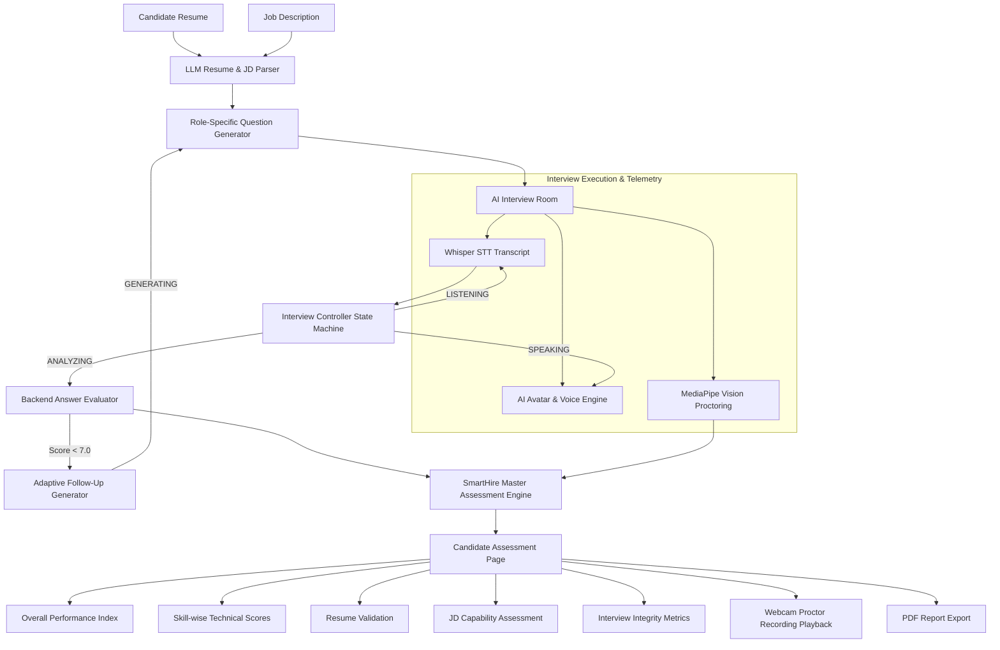

# SmartHire AI — Autonomous Mock Interview & Candidate Assessment Platform

> **SmartHire AI** is a state-of-the-art, end-to-end AI-powered mock interview and multi-dimensional candidate evaluation platform. It combines real-time video avatar presenters, speech transcription, vision proctoring telemetry, adaptive follow-up probing questions, and structured LLM evaluation to generate comprehensive candidate assessment reports.

---

## 🌟 Key Features

### 1. Pre-Interview Resume & JD Understanding
- **LLM Structured Parser**: Extracts candidate technical skills, projects, work experience, education, certifications, and target role from resumes.
- **JD Requirement Synthesis**: Parses job description text to extract required technical skills, key responsibilities, experience levels, and behavioral criteria.
- **Role-Specific Question Generator**: Dynamically synthesizes customized interview questions enriched with metadata (`question_type`, `expected_skills`, `difficulty`, `topic`, `expected_points`).

### 2. Live Interactive AI Interview Room
- **Lifelike AI Presenter**: Photorealistic virtual avatar with natural micro-movements, lip-sync waveform animation, and voice synthesis.
- **Ultravox WebRTC Voice & Whisper STT**: Ultra-low-latency real-time voice conversation powered by Ultravox WebRTC and Groq Whisper audio transcription.
- **Controlled Interview State Machine**: Driven by an explicit state controller pipeline:
  $$\text{SPEAKING} \longrightarrow \text{LISTENING} \longrightarrow \text{ANALYZING} \longrightarrow \text{GENERATING} \longrightarrow \text{SPEAKING}$$
  - **🔊 SPEAKING**: AI reads question prompt with live subtitle overlay.
  - **🎤 LISTENING**: Captures candidate verbal answer continuously with silence-detection trigger.
  - **🤖 ANALYZING**: Backend LLM evaluates answer correctness, relevance, depth, resume context, and JD alignment in real-time.
  - **🤖 GENERATING**: Synthesizes next question or generates dynamic adaptive follow-up probing questions for weak skill areas.

### 3. MediaPipe Proctoring & Vision Telemetry
- **Integrity Signal Tracking**: Real-time MediaPipe vision analyzer tracking Face Presence %, Single Face %, Face Missing Count, Looking Away Events, and Mobile Device / Face Cover Detection.
- **Separated Integrity Score**: Proctoring integrity metrics are tracked and displayed **separately** from candidate technical and behavioral skill scores (ensuring looking away doesn't artificially pollute candidate technical scores).

### 4. Adaptive Assessment Engine
- **Dynamic Follow-Up Probing**: When a candidate gives a weak answer or low score (< 7.0) on a technical topic (e.g. SQL joins), the AI automatically generates and asks a targeted follow-up question to test foundational knowledge.

### 5. Multi-Dimensional Assessment Report
- **Overall Score Card**: Calculated candidate index (e.g., `8.2 / 10 Strong Performance`).
- **6-Metric Performance Breakdown**: Technical Skills, Problem Solving, Communication, Behavioral, Resume Knowledge, JD Capabilities.
- **Skills Demonstrated & Needs Improvement**: Badged lists of proven skills vs growth areas.
- **Resume Validation (Depth Check)**: Validates whether candidates can actually defend resume claims during live questioning ("Demonstrated strongly" vs "Partially demonstrated").
- **JD Capability Match**: Evaluates candidate performance against specific job requirements.
- **Behavioral & Communication Audit**: 7 core behavioral dimensions + 7 communication parameters.
- **Question-by-Question Review**: Per-question audio transcript, expected key points, score out of 10, and structured feedback commentary.
- **Recorded Proctor Video Playback & Archive**: WebM video recording playback player with direct file download link.
- **One-Click PDF Export**: Download official candidate verification report PDF.

---

## 📐 System Architecture



---

## 🛠️ Technology Stack

### Backend
- **Framework**: Python 3.10+ / FastAPI
- **Database**: SQLite / SQLAlchemy ORM
- **AI / LLM Engine**: Groq API (`qwen/qwen3.6-27b`, `openai/gpt-oss-120b`)
- **Speech-to-Text**: Groq Whisper API (`whisper-large-v3`)
- **Real-Time Voice Call**: Ultravox WebRTC API

### Frontend
- **Framework**: React 19 / Vite
- **Styling**: Vanilla CSS, Tailwind CSS, Glassmorphism design system
- **Computer Vision**: MediaPipe Face Mesh & Vision Telemetry
- **Icons**: Lucide React
- **Export**: html2canvas & jsPDF

---

## 🚀 Getting Started & Local Setup

### Prerequisites
- Node.js (v18.0 or higher)
- Python (v3.10 or higher)
- Groq API Key (get key at [https://console.groq.com](https://console.groq.com))

---

### 1. Backend Setup

```bash
# Navigate to backend directory
cd backend

# Create a virtual environment (optional but recommended)
python -m venv venv
# On Windows:
venv\Scripts\activate
# On macOS/Linux:
source venv/bin/activate

# Install dependencies
pip install -r requirements.txt

# Configure environment variables in backend/.env
GROQ_API_KEY=your_groq_api_key_here
ULTRAVOX_API_KEY=your_ultravox_api_key_here

# Recreate database tables with latest models schema
python clear_db.py

# Start FastAPI backend server on port 8000
python -m uvicorn app.main:app --reload --port 8000
```

Backend will be accessible at:
- **API Server**: [http://localhost:8000](http://localhost:8000)
- **Interactive OpenAPI Docs**: [http://localhost:8000/docs](http://localhost:8000/docs)

---

### 2. Frontend Setup

```bash
# Navigate to frontend directory
cd frontend

# Install npm dependencies
npm install

# Start Vite frontend dev server
npm run dev
```

Frontend application will be accessible at:
- **Web Application**: [http://localhost:5173](http://localhost:5173)

---

## 📡 Primary API Endpoints

| Endpoint | Method | Description |
| :--- | :--- | :--- |
| `/api/v1/analyze/resume` | `POST` | Parses raw resume text into structured candidate JSON |
| `/api/v1/analyze/jd` | `POST` | Extracts required skills & responsibilities from Job Description |
| `/api/v1/analyze/generate-interview` | `POST` | Generates role-specific questions with metadata |
| `/api/v1/interview/setup` | `POST` | Initializes interview session |
| `/api/v1/interview/evaluate-answer` | `POST` | Evaluates single answer against resume/JD context |
| `/api/v1/interview/adaptive-question` | `POST` | Generates dynamic follow-up probing question for weak skill |
| `/api/v1/interview/evaluate/{session_id}` | `POST` | Compiles master candidate assessment report |
| `/api/v1/interview/save-details` | `POST` | Stores session, questions, answers, and scores into SQLite DB |
| `/api/v1/interview/upload-recording/{session_id}` | `POST` | Archives webcam WebM proctor video file |
| `/api/v1/interview/transcribe` | `POST` | Whisper speech-to-text audio transcription |

---

## 📄 License

This project is licensed under the MIT License.
