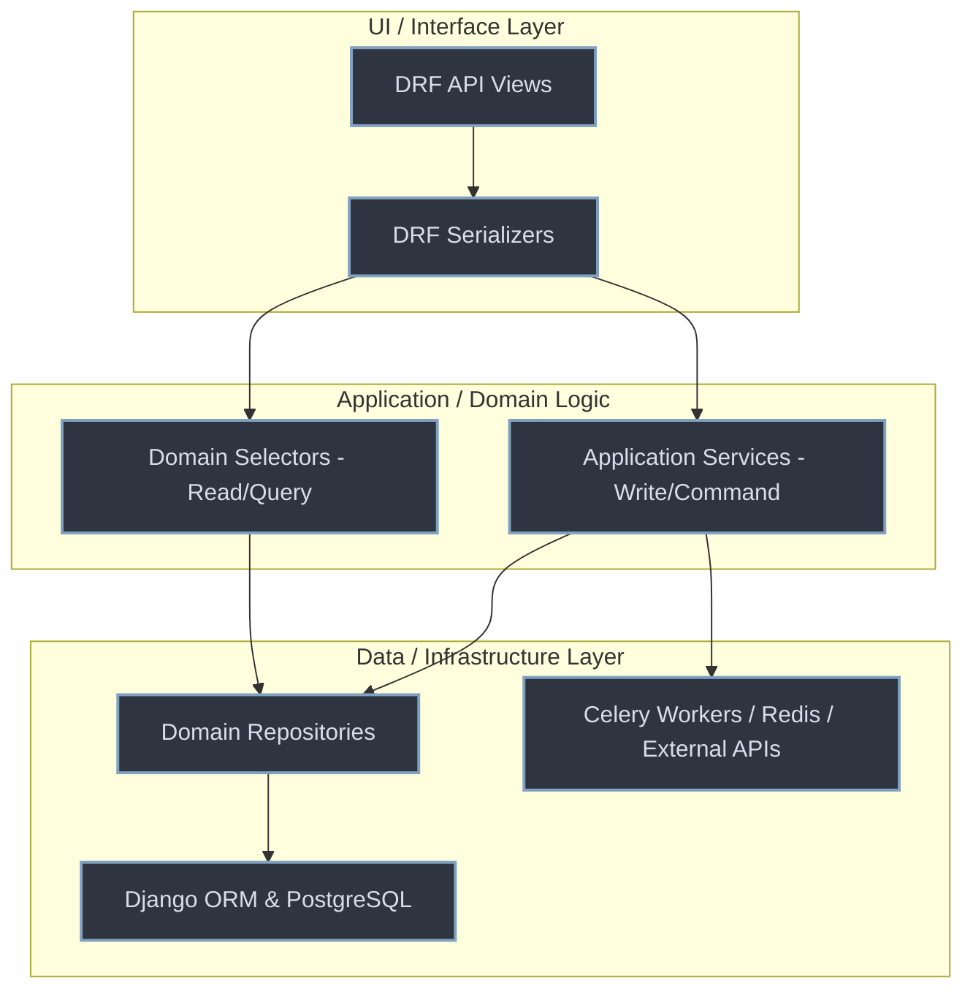

# SmartHire AI — Backend

AI-powered mock interview and candidate assessment platform.

---

## Architecture

Clean Architecture + Domain-Driven Design (DDD) inspired modular monolith. Every layer has a strict single direction of dependency: **View → Service/Selector → Repository → ORM Models**.



### 1. Core Architectural Layers

*   **API Views & Serializers (Interface Adapters)**: Responsible strictly for HTTP protocol concerns: extracting headers, parsing query parameters, executing permissions check, and returning structured JSON. Serializers validate input formats and schema constraints. No business rules are allowed in this layer.
*   **Application Services (Use Cases - Command/Write)**: Orchestrate transaction boundaries and coordinate domain logic. They process modifications, write records, and schedule asynchronous tasks. They depend on abstract repository interfaces and external adapters rather than concrete database classes (Dependency Inversion Principle).
*   **Domain Selectors (Read/Query)**: Dedicated query-only interfaces that bypass services for read paths (implementing a CQRS-ish separation). Selectors house database joins, aggregates, and caching layers to build view models for the frontend.
*   **Domain Repositories (Data Access)**: Decouples the Django ORM from the service layer. All SQL query generation, filter chaining, and ORM accesses are isolated here. If the database engine or ORM changes, only this layer is rewritten.
*   **Infrastructure (Adapters)**: Interfaces for third-party systems such as SendGrid/SMTP for mail dispatch, Redis for locking/caching, Celery for queue processing, and speech-to-text/LLM engines.

---

```
backend/
├── config/               # Django settings (base/dev/prod), root URLs, Celery
├── core/                 # Cross-cutting: exceptions, responses, permissions,
│                         # pagination, middleware, base service/repository,
│                         # DI container
├── infrastructure/       # External concerns: cache (Redis), storage (local/S3),
│                         # queue (Celery), monitoring (Sentry), email providers
├── apps/
│   ├── identity/         # Auth (JWT + OAuth2), RBAC, user management
│   │   ├── models/       # user.py, role.py, organization.py
│   │   ├── repositories/ # interfaces.py, user_repository.py
│   │   ├── services/     # auth_service.py, user_service.py
│   │   ├── selectors/    # user_selector.py  (read-only queries)
│   │   └── api/          # serializers/, views/, urls.py
│   │
│   ├── candidate/        # Candidate profiles
│   │   ├── models/       # candidate_profile.py
│   │   ├── repositories/ # candidate_repository.py
│   │   ├── services/     # profile_service.py
│   │   └── api/
│   │
│   ├── resume/           # Upload → Parse → Extract → Summarise pipeline
│   │   ├── models/       # resume.py, extracted_skill.py
│   │   ├── repositories/ # resume_repository.py
│   │   ├── services/     # upload_service.py, parsing_service.py,
│   │   │                 # extraction_service.py, summary_service.py
│   │   ├── providers/    # mock_extractor.py, openai_extractor.py,
│   │   │                 # gemini_extractor.py (template)
│   │   ├── tasks/        # resume_tasks.py  (Celery)
│   │   └── api/
│   │
│   ├── interview/        # Templates, question generation, session lifecycle
│   │   ├── models/       # interview_template.py, question.py,
│   │   │                 # session.py, answer.py
│   │   ├── services/     # session_service.py
│   │   ├── selectors/    # session_selector.py
│   │   └── api/
│   │
│   ├── assessment/       # Speech analysis, rubric scoring, feedback
│   │   ├── models/       # speech_analysis.py, communication_score.py,
│   │   │                 # confidence_score.py, technical_score.py,
│   │   │                 # professionalism_score.py, final_score.py,
│   │   │                 # session_feedback.py
│   │   ├── strategies/   # communication_strategy.py, confidence_strategy.py,
│   │   │                 # technical_strategy.py, professionalism_strategy.py
│   │   ├── services/     # speech_analysis_service.py, scoring_service.py,
│   │   │                 # feedback_service.py
│   │   ├── tasks/        # scoring_tasks.py  (async pipeline)
│   │   └── api/
│   │
│   ├── analytics/        # Read-only aggregations / dashboards
│   │   ├── selectors/    # analytics_selector.py  (cross-domain queries)
│   │   ├── services/     # dashboard_service.py, report_service.py
│   │   └── api/
│   │
│   ├── notification/     # In-app notifications + email dispatch
│   │   ├── models/       # notification.py
│   │   ├── providers/    # interfaces.py, smtp.py, sendgrid.py
│   │   ├── services/     # email_service.py, reminder_service.py
│   │   ├── tasks/        # reminder_tasks.py  (Celery beat)
│   │   └── api/
│   │
│   └── ai/               # AI ports and adapters (no business logic here)
│       ├── providers/
│       │   ├── speech/   # interfaces.py, mock_provider.py, whisper_provider.py
│       │   ├── emotion/  # interfaces.py, mock_provider.py, deepface_provider.py
│       │   ├── eye_tracking/ # interfaces.py, mock_provider.py, mediapipe_provider.py
│       │   └── llm/      # interfaces.py, mock_question_generator.py,
│       │                 # openai_question_generator.py, mock_feedback_generator.py,
│       │                 # openai_feedback_generator.py
│       └── factories/    # provider_factory.py  (maps config → adapter)
│
├── tests/
│   ├── unit/             # test_scoring.py
│   └── integration/      # test_auth.py
│
├── docker/
│   ├── django/Dockerfile
│   ├── nginx/nginx.conf
│   └── postgres/init.sql
│
└── scripts/
    ├── create_superuser.py
    └── seed_demo_data.py
```

---

## SOLID & Design Patterns

| Principle | Where applied |
|---|---|
| **SRP** | `UploadService`, `ParsingService`, `ExtractionService`, `SummaryService` each own one step of the resume pipeline |
| **OCP** | New AI providers plug into existing `IXxxProvider` interfaces without changing services |
| **LSP** | Every `Mock*Provider` / `OpenAI*Provider` pair is fully interchangeable behind its interface |
| **ISP** | `ISpeechToTextProvider`, `IEmotionDetectionProvider`, `IEyeContactTrackingProvider`, `IQuestionGenerationProvider`, etc. — each narrow and purpose-specific |
| **DIP** | Services depend on abstract interfaces; `core/container.py` + `AIProviderFactory` are the only places that import concrete adapters |
| **Strategy** | `CommunicationStrategy`, `ConfidenceStrategy`, `TechnicalStrategy`, `ProfessionalismStrategy` — one file per rubric category, injected into `ScoringService` |
| **Repository** | `UserRepository`, `ResumeRepository`, `CandidateProfileRepository` — the only ORM query sites for their domain |
| **Factory** | `AIProviderFactory` maps `AI_SERVICE_PROVIDER` setting to concrete adapters |
| **CQRS-ish** | `selectors/` (read) vs `services/` (write) in every domain app |

---

## System Control & Data Flows

### 1. API Request & Command Flow (Clean Architecture)

```
[Candidate / Recruiter HTTP Request]
                 │
                 ▼
     [DRF Views (Interface)] 
  (Handles route, authentication check)
                 │
                 ▼
  [DRF Serializers (DTO/Validation)]
 (Input parsing, type validation, structure)
                 │
                 ▼
   [Application Services (Command)]   <─────►   [Application Selectors (Query)]
(Transactional business rules execution)         (Bypasses service logic for reads)
                 │                                             │
                 ▼                                             ▼
       [Domain Repositories]                  <────────────────┘
  (Constructs database queries, filters)
                 │
                 ▼
   [Django ORM / PostgreSQL Database]
```

### 2. Resume Parsing & Profile Pipeline (Asynchronous)

```
[Resume PDF Upload] ──► [API View] ──► [Schedule Celery parsing_task]
                                                 │
  ┌──────────────────────────────────────────────┘
  ▼
[ParsingService] ──────► Extracts raw text content from PDF document
  │
  ▼
[ExtractionService] ───► Prompts LLM (OpenAI/Gemini) to parse structured schema (skills, work history)
  │
  ▼
[SummaryService] ──────► Generates candidate highlights and structured index profile
  │
  ▼
[ProfileRepository] ───► Persists to CandidateProfile & ExtractedSkills in DB
```

### 3. Realtime Voice Call & Transcript Flow (Ultravox WebRTC)

```
 [Candidate Browser]             SmartHire Django Backend              Ultravox WebRTC Server
         │                                   │                                    │
         │─── Accept Invitation ────────────►│                                    │
         │                                   │─── generate_seed_topics_task ─────►│ (Pre-caches LLM instructions
         │                                   │    (Builds resume-aware topics)    │  with topic list)
         │                                   │                                    │
         │─── Request WebRTC Credentials ───►│                                    │
         │                                   │─── Create Call REST API ──────────►│
         │                                   │◄── Return WebRTC Join URL ─────────│
         │◄── Return Join URL ───────────────│                                    │
         │                                                                        │
         │─── Establish Direct Audio Connection (WebRTC) ────────────────────────►│
         │                                                                        │
         │◄═══ Host Voice Interview & Ask Questions ══════════════════════════════│
         │                                                                        │
         │                                   │◄── Webhook: transcript.turn ───────│ (Pushes audio transcript
         │                                   │    (Records client/agent text)     │  on every turn)
         │                                   │                                    │
         │                                   │◄── Tool Webhook: ask-next-topic ───│ (Fired mid-call when 
         │                                   │    (Updates current active topic)  │  candidate completes a topic)
         │                                   │                                    │
         │─── End Call / Leave ──────────────│                                    │
         │                                   │─── Terminate Session ─────────────►│
         │                                   │                                    │
         │                                   ▼
         │                        [Celery Scoring & Brief Pipeline]
```

### 4. Post-Session Scoring & Brief Pipeline (Asynchronous)

```
[Session Complete Signal]
           │
           ▼
[Schedule Celery run_assessment_pipeline]
           │
           ▼
[SpeechAnalysisService]
   ├── ISpeechToTextProvider      ──► Merges Ultravox transcript logs
   ├── ICommunicationProvider     ──► Analyzes pace, grammar, filler words
   ├── IEmotionDetectionProvider  ──► Evaluates WebRTC sentiment telemetry
   └── IEyeContactTrackingProvider ──► Analyzes pupil center focus telemetry
           │
           ▼
[ScoringService (Strategy Pattern)]
   ├── CommunicationStrategy (30% weight) ──► Computes pacing, grammar scores
   ├── ConfidenceStrategy    (25% weight) ──► Computes emotional & eye contact scores
   ├── TechnicalStrategy     (30% weight) ──► Computes accuracy & depth of answers
   └── ProfessionalismStrategy(15% weight) ──► Computes focus & tone scores
           │
           ▼
[FeedbackService]
   └── Prompts LLM (Gemini/OpenAI) to generate brief reviews, verdict and candidate scorecards
           │
           ▼
[NotificationService]
   └── Dispatches notification signals & emails recruiters and candidates
```

---

---

## Switching AI Providers

Set `AI_SERVICE_PROVIDER=mock` (default — zero dependencies, deterministic) or
`AI_SERVICE_PROVIDER=openai` in `.env`. `AIProviderFactory` in
`apps/ai/factories/provider_factory.py` is the only file that changes.
No service, serializer, or view needs editing.

Same pattern for email: `EMAIL_PROVIDER=smtp` (default) or `EMAIL_PROVIDER=sendgrid`.

---

## What uses Django built-ins instead of custom code

- **Auth**: `AbstractBaseUser` + `PermissionsMixin` + `djangorestframework-simplejwt` (JWT, refresh, blacklist) + `social-auth-app-django` (Google OAuth2)
- **Admin**: Standard Django admin extended with `UserAdmin` — no custom admin UI
- **Password hashing/validation**: Django's built-in validators and `set_password`/`check_password`
- **Email**: Django's `send_mail` / `EMAIL_BACKEND` — the SMTP provider is a one-liner wrapper
- **ORM, migrations, transactions**: standard Django throughout

---

## Local Setup & Development Workflows

You can run the application in two ways: **Natively (Multiplexed Local Terminals)** or via **Docker Compose**. 

For real-time voice call functionality (Ultravox WebRTC), you must expose your local server using a tunnel (like `ngrok`) so the external AI service can call your webhook endpoints.

---

### Method A: Native Local Development (Windows / macOS / Linux)

This setup runs services directly on your host machine.

#### Step 1: Base Environment Setup
```bash
git clone <repo>
cd backend
cp .env.example .env          # edit as needed (set AI_SERVICE_PROVIDER, etc.)
python -m venv .venv

# Windows activation:
.venv\Scripts\activate
# Linux/macOS activation:
source .venv/bin/activate

pip install -r requirements/dev.txt
python manage.py migrate
python manage.py shell < scripts/seed_demo_data.py
```

#### Step 2: Running the Services (4-Terminal Loop)

*   **Terminal 1 — ngrok Tunnel (Required for WebRTC Webhooks)**
    Expose your local port 8000 to the public web:
    ```bash
    ngrok http 8000
    ```
    *Copy the resulting `https://<your-subdomain>.ngrok-free.app` URL. Keep this terminal open.*

*   **Terminal 2 — Django Server**
    ```bash
    cd backend
    python manage.py runserver
    ```

*   **Terminal 3 — Celery Worker**
    *   **Windows**: Celery does not support standard unix-preforking natively. You **must** specify the `solo` pool:
        ```bash
        cd backend
        .venv\Scripts\activate
        celery -A config worker --loglevel=info --pool=solo
        ```
    *   **macOS / Linux**:
        ```bash
        cd backend
        source .venv/bin/activate
        celery -A config worker --loglevel=info
        ```

*   **Terminal 4 — Register Ultravox Webhooks**
    Provide Ultravox with your public ngrok gateway to route transcript feeds and custom tool calls:
    ```bash
    cd backend
    uv run manage.py setup_realtime_webhook
    ```

---

### Method B: Docker Compose Development (Recommended for Isolation)

Docker Compose containerizes PostgreSQL, Redis, Django, and Celery, running them in a Linux environment natively.

#### Step 1: Run the Docker Stack
```bash
cp .env.example .env          # edit env values as needed
docker compose up --build
```
*This command starts PostgreSQL, Redis, Django (on port 8000), Celery Worker (using standard preforking), and Celery Beat.*

#### Step 2: Configure Webhooks for Ultravox (Realtime Call Loop)

*   **Terminal 1 — ngrok Tunnel**
    Expose the Docker-mapped port `8000` to the public internet:
    ```bash
    ngrok http 8000
    ```

*   **Terminal 2 — Webhook Registration**
    Execute the webhook registration command inside the running Django container:
    ```bash
    docker compose exec web python manage.py setup_realtime_webhook
    ```

---

## Tests

```bash
pytest
```

---

## API Docs

| URL | Description |
|---|---|
| `/api/docs/` | Swagger UI |
| `/api/redoc/` | ReDoc |
| `/api/schema/` | OpenAPI 3 schema |
| `/admin/` | Django admin |

## Key Endpoints

| Method | URL | Description |
|---|---|---|
| POST | `/api/v1/auth/register/` | Register candidate or recruiter |
| POST | `/api/v1/auth/login/` | Obtain JWT tokens |
| POST | `/api/v1/auth/token/refresh/` | Refresh access token |
| POST | `/api/v1/auth/logout/` | Blacklist refresh token |
| GET/PATCH | `/api/v1/auth/me/` | Current user profile |
| GET/PATCH | `/api/v1/candidates/profile/` | Candidate profile |
| POST | `/api/v1/resumes/upload/` | Upload resume (triggers async AI extraction) |
| GET | `/api/v1/resumes/` | List candidate resumes |
| POST | `/api/v1/interviews/sessions/create/` | Create session (AI question generation) |
| POST | `/api/v1/interviews/sessions/{id}/start/` | Start session |
| POST | `/api/v1/interviews/sessions/{id}/answer/` | Submit answer |
| POST | `/api/v1/interviews/sessions/{id}/complete/` | Complete → triggers assessment pipeline |
| GET | `/api/v1/assessments/sessions/{id}/analysis/` | Speech analysis results |
| GET | `/api/v1/assessments/sessions/{id}/score/` | Final weighted score |
| GET | `/api/v1/assessments/sessions/{id}/feedback/` | AI-generated feedback |
| GET | `/api/v1/analytics/candidate/dashboard/` | Full candidate dashboard |
| GET | `/api/v1/analytics/recruiter/rankings/` | Candidate rankings |
| GET | `/api/v1/analytics/recruiter/overview/` | Platform overview |
| GET | `/api/v1/notifications/` | List notifications |
| POST | `/api/v1/notifications/read-all/` | Mark all as read |
